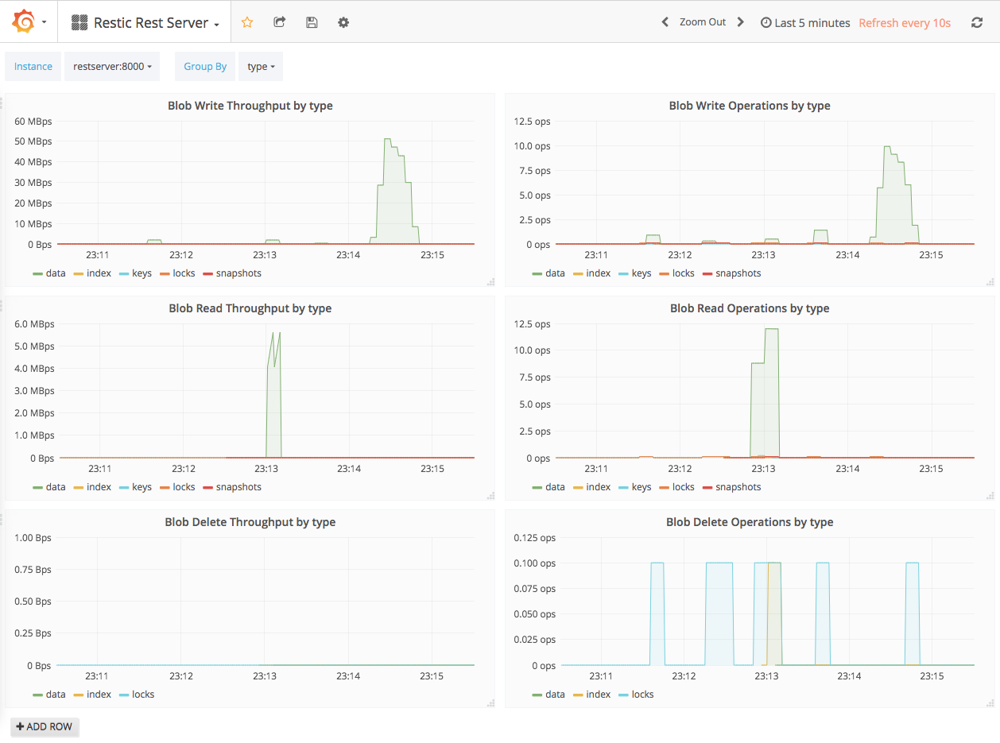
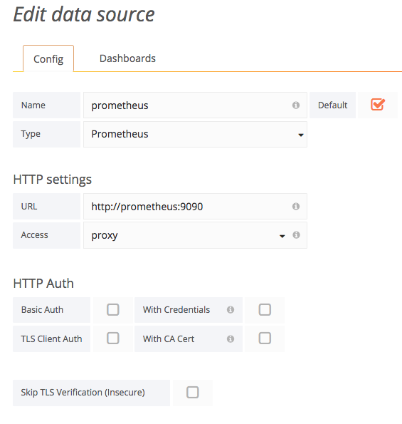

# Rest Server Grafana Dashboard

This is a demo [Docker Compose](https://docs.docker.com/compose/) setup for [Rest Server](https://github.com/restic/rest-server) with [Prometheus](https://prometheus.io/) and [Grafana](https://grafana.com/).

## Quickstart

Build `rest-server` in Docker:

    cd ../..
    make docker_build
    cd -

Bring up the Docker Compose stack:

    docker-compose build
    docker-compose up -d

Check if everything is up and running:

    docker-compose ps

Grafana will be running on [http://localhost:8030/](http://localhost:8030/) with username "admin" and password "admin".  The first time you access it you will be asked to setup a data source. Configure it like this (make sure you name it "prometheus", as this is hardcoded in the example dashboard):

The Rest Server dashboard can be accessed on [http://localhost:8030/dashboard/file/rest-server.json](http://localhost:8030/dashboard/file/rest-server.json).

Prometheus can be accessed on [http://localhost:8020/](http://localhost:8020/).

If you do a backup like this, some graphs should show up:

    restic -r rest:http://127.0.0.1:8010/demo1 -p ./demo-passwd init
    restic -r rest:http://127.0.0.1:8010/demo1 -p ./demo-passwd backup .
