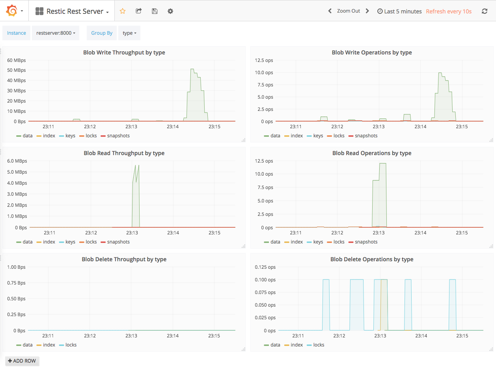

# Rest Server Grafana Dashboard

This is a demo [Docker Compose](https://docs.docker.com/compose/) setup for [Rest Server](https://github.com/restic/rest-server) with [Prometheus](https://prometheus.io/) and [Grafana](https://grafana.com/).

## Quickstart

Bring up the Docker Compose stack (Optionally add `--build` to build image from repository instead of downloading):

    docker compose up -d

Check if everything is up and running:

    docker compose ps

Grafana will be running on [http://localhost:8030/](http://localhost:8030/) with username "admin" and password "admin". When you login, you should be greeted by the dashboard, without any data.

Prometheus can be accessed on [http://localhost:8020/](http://localhost:8020/).

If you do a backup like this, some graphs should show up:

    restic -r rest:http://127.0.0.1:8010/demo1 -p ./demo-passwd init
    restic -r rest:http://127.0.0.1:8010/demo1 -p ./demo-passwd backup .
